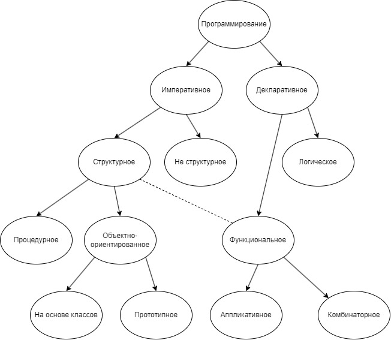

Шпаргалка по диаграмме парадигм программирования (с описанием)
==============================================================================================

Императивное программирование
-----------------------------

Императивное программирование характеризуется в основном:
1. в исходном коде программы записываются инструкции (команды);
2. инструкции должны выполняться последовательно;
3. каждая инструкция может изменять некое глобальное “состояние” программы

При императивном подходе к составлению кода (в отличие от функционального подхода, относящегося к декларативной парадигме) широко используется присваивание. Наличие операторов присваивания увеличивает сложность модели вычислений и делает императивные программы подверженными специфическим ошибкам, не встречающимся при функциональном подходе. Практически всё аппаратное обеспечение в основе своей императивное.

Неструктурное программирование
------------------------------

Характерно для наиболее ранних языков программирования. В основном характеризуется:
1. строки как правило нумеруются
2. из любого места программы возможен переход к любой строке

Характерной особенностью неструктурного программирования является сложность реализации рекурсии.

Структурное программирование
----------------------------

В отличие от неструктурного программирования, характеризуется:
1. ограниченным использованием условных и безусловных переходов
2. широким использованием подпрограмм и прочих управляющих структур (циклов, ветвлений, и т.п.)
3. блочной структурой

Процедурное программирование
----------------------------

Процедурное программирование можно рассматривать как небольшую вариацию на тему структурного программирования, основанную на концепции вызова процедуры. Основная идея заключается в том, чтобы сделать подпрограммы более модульными за счёт:
1. локальных переменных
2. относительно простой рекурсии

Оба этих пункта реализуются за счёт использования стека вызовов.

Объектно-ориентированное программирование
-----------------------------------------

Объектно-ориентированное программирование основано на концепции “объекта”. Объекты могут содержать данные (поля, свойства, аттрибуты) и поведение (код, процедуры, методы). Наиболее популярной формой ООП является ООП на основе классов. В данном подходе, все объекты являются экземплярами классов, и классы определяют так же тип объектов. Одной из альтернатив является прототипное наследование. Прототипное наследование не использует классов. Вместо этого, одни объекты могут быть объявлены “прототипами” других объектов – при этом методы и поля прототипа становятся доступны как методы и поля нового объекта (если, конечно, новый объект их не переопределяет)

Декларативное программирование
------------------------------

Декларативное программирование — это парадигма программирования, в которой задаётся спецификация решения задачи, то есть описывается, что представляет собой проблема и ожидаемый результат. Противоположностью декларативного является императивное программирование, описывающее на том или ином уровне детализации, как решить задачу и представить результат. Как следствие, декларативные программы не используют понятия состояния, то есть не содержат переменных и операторов присваивания. К подвидам декларативного программирования также зачастую относят функциональное и логическое программирование — несмотря на то, что программы на таких языках нередко содержат алгоритмические составляющие. “Чисто декларативные” компьютерные языки зачастую не полны по Тьюрингу — примерами служат SQL и HTML — так как теоретически не всегда возможно порождение исполняемого кода по декларативному описанию. Это иногда приводит к спорам о корректности термина “декларативное программирование”.

Функциональное программирование
-------------------------------

Основные концепции:
1. отсутствие неявных побочных эффектов
2. ссылочная прозрачность
3. отсутствие неявного состояния
4. данные и функции – это концептуально одно и то же

Основано на лямбда-исчислении

Аппликативное
-------------

Аппликативное программирование — один из видов декларативного программирования, в котором написание программы состоит в систематическом осуществлении применения одного объекта к другому. Результатом такого применения вновь является объект, который может участвовать в применениях как в роли функции, так и в роли аргумента и так далее. Это делает запись программы математически ясной. Тот факт, что функция обозначается выражением, свидетельствует о возможности использования значений-функций — функциональных объектов — на равных правах с прочими объектами, которые можно передавать как аргументы, либо возвращать как результат вычисления других функций.

Комбинаторное
-------------

Комбинаторное программирование (англ. function-level programming) — парадигма программирования, использующая принципы комбинаторной логики. Является особой разновидностью функционального программирования, но, в отличие от основного его направления, комбинаторное программирование не использует λ-абстракцию. На практике это выливается в отсутствие “переменных”, содержащих данные.

Логическое программирование
---------------------------

Логическое программирование — парадигма программирования, основанная на автоматическом доказательстве теорем, а также раздел дискретной математики, изучающий принципы логического вывода информации на основе заданных фактов и правил вывода. Логическое программирование основано на теории и аппарате математической логики с использованием математических принципов резолюций.
